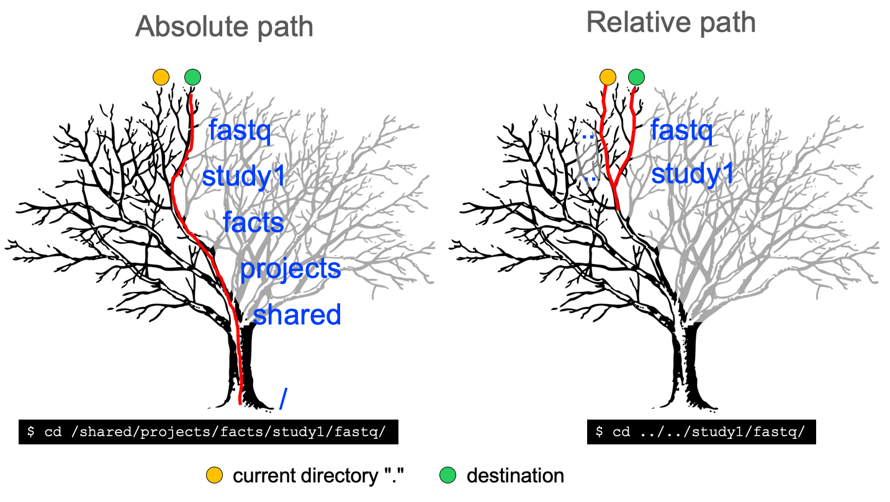

The files are arranged in a tree structure. 

In this structure, folders can be seen as branches and files as leaves.
Each file has a unique *path* in the tree structure when starting from the root.
This path is composed of all the names of the different folders from the root of the tree to the file.
Each folder name is separated by a `/` when you write the path.
The root of the tree structure is represented by the first `/` in path.

# absolute path

A path described from the root of the tree is called an absolute path.

# relative path

One may also refer to a filesystem object relatively to a folder where one is currently located. 
We call this folder the *current working directory*. Its path can be obtained using the `pwd` command (**p**rint **w**orking **d**irectory). 

  `pwd`

